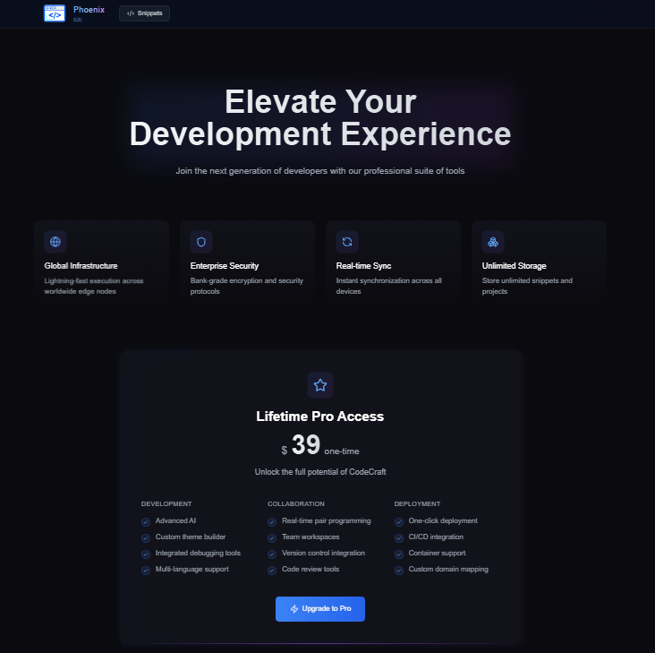

# 🌟 Phoenix Code Editor

Phoenix Code Editor is a **modern, browser-based coding environment** designed for speed, simplicity, and collaboration.  
It supports multiple programming languages, live code execution, theming, snippet starring, and premium features powered by **Stripe**.

🚀 **Live Demo:** [https://code-editor-rrf4.vercel.app/](https://code-editor-rrf4.vercel.app/)

---

## 📸 Preview

### 🏠 Main Page
  
*Clean, responsive landing page for starting your coding journey.*

### 🔑 Clerk Authentication (Register/Login)
  
*Secure authentication powered by Clerk.*

### ⚙️ Code Execution & Error Handling
  
*Write and run code instantly with real-time error feedback.*

### 🎨 Multiple Themes
  
*Switch between several VS Code–style themes for a personalized look.*

### ⭐ Snippet Starring
*Star your favorite code snippets so they can be accessed later by others.*

### 💳 Premium Payment via Stripe
*Upgrade to unlock premium features using secure Stripe payments.*

---

## ✨ Features

- **Multi-language support** — Run code in multiple programming languages.
- **Clerk authentication** — Easy registration and secure login.
- **Live code execution** — Instant output with syntax highlighting.
- **Error handling** — Clear, readable error messages.
- **Multiple themes** — VS Code–inspired designs.
- **Snippet starring** — Save & share your favorite code snippets.
- **Premium tier** — Unlock extra features with Stripe payments.
- **Responsive design** — Works on desktop and mobile.

---

## 🛠 Tech Stack

- **Frontend:** Next.js 15, React, TypeScript
- **Styling:** Tailwind CSS
- **Authentication:** Clerk
- **Backend:** Convex
- **Payments:** Stripe
- **Hosting:** Vercel

---

